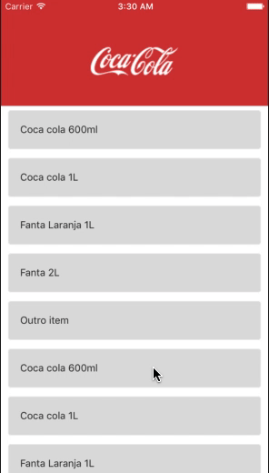

# react-native-flatlist-header-animated

## Install
> npm i react-native-flatlist-header-animated



## Custom FlatlistHeader
> Component based 100% on React-Native's own Flatlist

| Props | Value Type | Description |
|--|--|--|
| icon | Component RN | If you want to insert a component in the right corner |
| image | Image path to be used | require if image local or {uri: url} from image web |
| navBar | Number | Size the Nav bar should be when scrolling up |
| height | Number | Size at which the component must occupy when scrolling down  |
| color | Color Hexadecimal | Component background color, default #333 |
| marginImage | Number | fine adjustments to the image position when scrolling up |

## Usage :
### 1- add below import in your code :
```js
import { FlatlistHeader } from "react-native-flatlist-header-animated";
```
### 2- Define the props according to the documentation above or copy the example below.

```js
<FlatlistHeader
   data={data}
   renderItem={({item}) => <Item item={item} />}
   keyExtractor={item  =>  item.id}
   
   icon={<Icon type='Feather' name='bell' />}
   image={require('./src/assets/logo.png')}
   navBar={80}
   height={150}
   color={'#d13636'}
   marginImage={270}
/>
```
